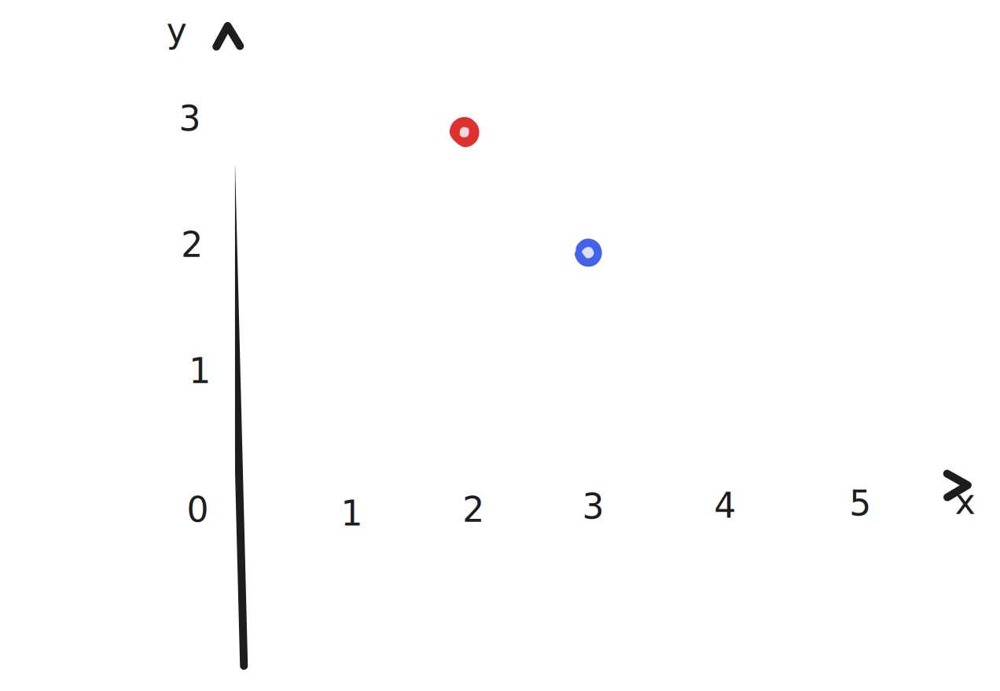

# Vectors

* Start chapter :b{#bbhp9}

In school, you learned how to plot points on "math paper".
Here are two example points:

We call the horizontal line $x$ and the vertical line $y$.
We draw a number line on each of them.
Then we can describe any point on the paper using the point's position on each line.
The red point has $x = 2$ and $y = 3$.
What is the $x$ value of the blue point?
:buttons{#dlg5n}

* $3$ :b{#ye00u .correct}
* $2$ :b{#b8q8b .incorrect}

  No, that's actually the blue point's $y$ value.
  To get its $x$ value, read across the horizontal.

  * Okay :b{#syovo}

If a point has $x = 2$ and $y = 3$,
a mathematician might write that the point is $(2,3)$,
or $[\begin{smallmatrix}2\\3\end{smallmatrix}]$.
But we will write the point in Python notation: `[2,3]`.
We call this object `[2,3]` a **vector.**

Saying `p = [2,3]` is nicer than saying `px = 2` and `py = 3`.
Everything about the point is packaged in one object,
and we don't have to make up names like `x` and `y`.

So far, we've been describing 2D space.
The kind of space that old arcade games use.
But now imagine a 3D space, like the one you live in.
We usually imagine the lines $x$ and $y$ as before,
plus a new line called $z$,
which is perpendicular to the $x$ and $y$ lines.
Imagine a point $q$ in space which has $x = 5$, $y = 2$, and $z = 8$.
How would we write this point in vector notation?
:buttons{#ruupf}

* `[5,2,8]` :b{#hpd1t .correct}

  Right, we're writing the vector in the order `[x,y,z]`.

* `[8,2,5]` :b{#dflru}

  You're not exactly wrong!
  Normally, we would write the vector in the order `[x,y,z]`.
  But this is just a convention,
  and we certainly could write it as `[z,x,y]`, as you did.
  Let's continue with the order `[x,y,z]`.

Consider the point `[1,0,1,0,1]`.
It "lives" in some space.
How many dimensions does that space have?
:buttons{#lqzpm}

* 1 dimension :b{#qmmun .incorrect}
* 3 dimensions :b{#pb1fj .incorrect}
* 5 dimensions :b{#m2mah .correct}

Mathematicians call this space $\R^5$.
(Don't take the "to the power of 5" too seriously -- it's just notation.)

Which of these vectors lives in $\R^1$?
:buttons{#rbqr6}

* `1` :b{#rz4k1}
* `[1]` :b{#vue2w}
* `[1,1]` :b{#dzxk2}

Now it's your chance to implement "vector-scalar multiplication".
Here's a Python shell for you to use:

:::iframe{url="https://tigyog-iframe-example-python-repl.glitch.me/"}
    print(42)
    print(43)
:::
